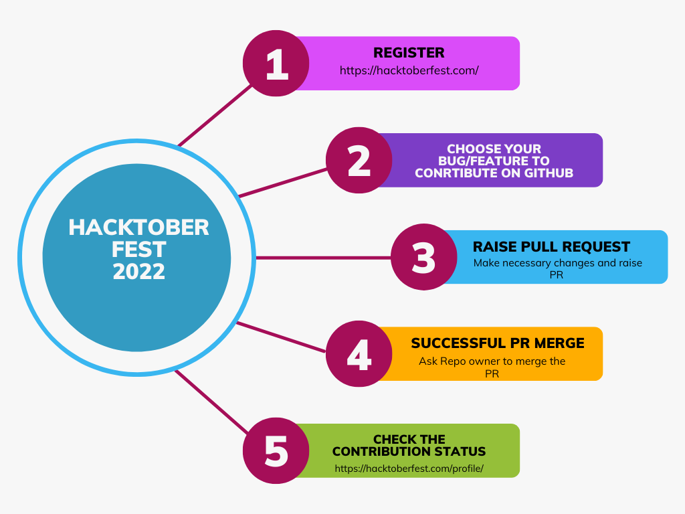

# Hacktoberfest 2022
Submit Your contributions.


Submit or Create Anything
I will review and merge your PRs

Follow these steps to open and successful PR and earn swags.!!!


</br>

Sign up on the following link: https://hacktoberfest.digitalocean.com

Step 1: Open this link: https://github.com/itsprueba/Hacktoberfest/

Step 2: Star and Fork this repository. 

Step 3: Open cmd 

Step 4: ```git clone <forked url>```
  
Step 5: ```cd <Hacktoberfest>```
  
Step 6: ```git pull```

Step 7: ```git checkout -b [name_of_your_new_branch]```

Step 8: ```git branch -a```

Step 9: change the files in code which you want to change for your own sake.

Step 10: ```git add .```

Step 11: ```git commit -m "your message"```

Step 12: ```git push origin [name_of_your_new_branch]```


## What is Hacktoberfest?
>  Hacktoberfest is a month-long celebration of open source software run by DigitalOcean in partnership with GitHub and Twilio. Hacktoberfest is open to everyone in our global community!

## How to participate?
> You just need to make five contributions to open source before October 31 and can receive a free Hacktoberfest t-shirt.


```Goodies: 2022 Hactoberfest Tshirts```


## How can a beginner participate?
1. Technical contributions
2. Non technical contributoins

> For    `` Non technical contributions ``, they are saying that you could make contributions to documentation for some projects. But this also needs some level of effort. When I heard about Hacktoberfest, I just registered and leave it there without doing any contributions. But then I go through the list projects I find out some too easy projects to contribute to. So I`m listing here four Github repositories anyone can contribute to, it’s too easy, you just need to add your Github profile name etc in their readme file. Some of them have instructions on how to contribute. So let’s do it.
1. Register or login to github.com
2. Register to Hacktoberfest.
3. Contribute to [these](https://github.com/topics/hacktoberfest2022-accepted) repositories or any others repositories you like, check instructions to contribute in each repositories.
[bawantharathnayakasliit/first-contributions](https://bawantharathnayaka.medium.com/what-is-hacktoberfest-and-how-can-a-beginner-contribute-39cf2081804e)
It's hard. It's always hard the first time you do something. Especially when you are collaborating, making mistakes is common, but never give up keep trying
4. Check your progress from [here](https://hacktoberfestchecker.jenko.me/).
5. Post successful submission of 4 PR and accepted by respective projet owners , and Digital ocean conisiders it as valid contributions, Digital ocean will ask for shipping address via email to send you the goodies.
6. Wait for that awesome Hacktoberfest t-shirt from Github & Digital Ocean.

Finally Happy Hactoberfest Day :)
